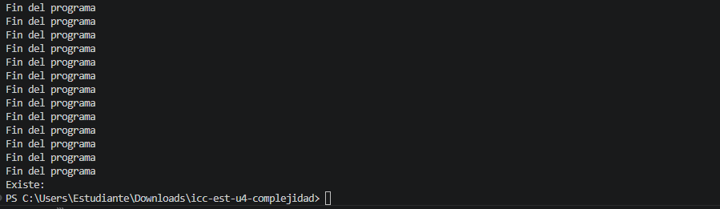

# Practica 04.01 Complejidad Proyecto JAVA

## Datos del Estudiante
- **Nombre:** Jorge Luis Padilla Mendez
- **Curso:** Grupo 6
- **Fecha:** 14/04/2026

---

## 1. [Título de la sección] o [Practica]

**Fecha:** 14/04/2026

**Descripción:** Creamos el proyecto y subimos a github

## 2. icc-est-u4-complejidad

**Fecha:** 15/04/26

**Descripción:** Creamos la clases Estudiante y Generador y 
creamos un listado de estudiantes con datos aleatorios para buscar y optimizar la busqueda. 